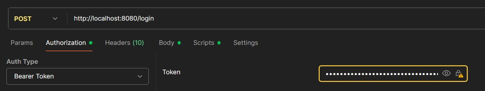

# API de Gerenciamento de Processos Judiciais

## 🎯 Objetivo

Este projeto consiste em uma API RESTful completa para gerenciar processos judiciais e suas respectivas audiências. A solução foi desenvolvida em Java com Spring Boot e vai além de um CRUD básico, implementando regras de negócio complexas, segurança com JWT, testes unitários e outras práticas de desenvolvimento de software moderno.

## 🛠️ Tecnologias Utilizadas

O projeto foi construído utilizando as seguintes tecnologias e conceitos:

* **Java 17**
* **Spring Boot 3**
* **Spring Web**
* **Spring Data JPA**
* **Spring Security**
* **Maven**
* **Banco de Dados em Memória (H2)**
* **JUnit 5 & Mockito** (Testes Unitários)
* **JSON Web Tokens (JWT)** (Autenticação)
* **Lombok**
* **Swagger/OpenAPI 3** (Documentação da API)
* **Padrão DTO (Data Transfer Object)**
* **Arquitetura em Camadas (Controller, Service, Repository, Model)**

## 📂 Estrutura do Projeto

A aplicação segue os princípios de arquitetura limpa, organizada nas seguintes camadas para garantir desacoplamento e manutenibilidade:

* `config`: Configurações de segurança e documentação.
* `controller`: Camada de apresentação, responsável por expor os endpoints REST.
* `service`: Camada de serviço, onde residem as regras de negócio da aplicação.
* `repository`: Camada de acesso a dados, responsável pela comunicação com o banco de dados via Spring Data JPA.
* `model`: Contém as entidades JPA que mapeiam as tabelas do banco de dados.
* `dto`: Data Transfer Objects, utilizados para definir os "contratos" da API, desacoplando a camada de apresentação do modelo de domínio.
* `exception`: Classes de exceção personalizadas para tratamento de erros de negócio.

## ✅ Checklist de Requisitos

A seguir, a lista de todos os requisitos solicitados e como foram implementados.

### 📘 Requisitos Funcionais

* **[✅] Cadastro de Processo Judicial:** Implementado via endpoint `POST /api/v1/processos`.
    * Campos (`número`, `vara`, `comarca`, `assunto`, `status`) estão presentes.
    * A unicidade do número é garantida pelo `@Column(unique=true)`.
* **[✅] Listar e Filtrar Processos:** Implementado via `GET /api/v1/processos` com parâmetros de query opcionais para `status` e `comarca`.
* **[✅] Agendamento de Audiências:** Implementado via `POST /api/v1/audiencias/processo/{processoId}`.
    * O relacionamento `Processo 1 -> N Audiencias` foi estabelecido com `@OneToMany`.
    * Os campos (`data/hora`, `tipo`, `local`) são recebidos via DTO.
* **[✅] Prevenção de Sobreposição de Audiências:** A lógica no `AudienciaService` verifica se já existe uma audiência na mesma vara, local e horário antes de agendar.
* **[✅] Consulta de Agenda:** Implementado via `GET /api/v1/audiencias/agenda`, que retorna as audiências de uma comarca em um dia específico.

### ⚖️ Regras de Negócio

* **[✅] Validação de Formato do Número do Processo:** Implementado com a anotação `@Pattern` do Jakarta Bean Validation no DTO de entrada.
* **[✅] Bloqueio de Agendamento para Processos Inativos:** O `AudienciaService` verifica o status do processo e lança uma `RegraNegocioException` se estiver `ARQUIVADO` ou `SUSPENSO`.
* **[✅] Agendamento Apenas em Dias Úteis:** O `AudienciaService` verifica se a data do agendamento cai em um sábado ou domingo.

### 🔐 Requisitos Não Funcionais

* **[✅] API RESTful com Spring Boot:** Projeto desenvolvido integralmente sobre esta tecnologia.
* **[✅] Banco de Dados em Memória (H2):** Configurado no `application.properties` para rodar em modo de memória.
* **[✅] Documentação com Swagger/OpenAPI:** Gerada automaticamente pela dependência `springdoc-openapi`.
* **[✅] Testes Unitários:** Foram criados testes para as principais regras de negócio no `AudienciaService` e para o `TokenService`, utilizando JUnit 5 e Mockito.
* **[✅] Estrutura de Projeto Limpa:** A estrutura de camadas descrita acima foi rigorosamente seguida.

### 🚀 Diferenciais Implementados

* **[✅] Versionamento da API:** Todos os endpoints estão sob o prefixo `/api/v1`.
* **[✅] Validação Personalizada:** Utilização de `@Valid` nos controllers e anotações de constraint nos DTOs para garantir a integridade dos dados de entrada.
* **[✅] Autenticação com Token JWT:** Toda a API (exceto o endpoint de login e documentação) é protegida. Foi implementado um fluxo completo de autenticação JWT, incluindo geração de token, um filtro de segurança e configuração do Spring Security.

---

## 🏆 Melhorias Adicionais (Extras)

Além dos requisitos solicitados, decidi implementar por conta própria a dockerização do projeto. Considero essencial que um projeto backend esteja dockerizado para facilitar e agilizar o processo de desenvolvimento, especialmente quando o projeto escala muito.

* **[📦] Suporte a Docker:**
  * **O que foi feito:** A aplicação foi dockerizada utilizando um `Dockerfile` multi-estágio otimizado. Este processo gera uma imagem Docker leve e segura, pronta para produção.
  * **Por quê:** Para garantir que a aplicação possa ser executada de forma consistente em qualquer ambiente que suporte Docker, facilitando o processo de build, deploy e escalabilidade, além de isolar a aplicação e suas dependências.
  * **Como usar:**
    1. Construa a imagem Docker na raiz do projeto: `docker build -t judicialmanagement .`
    2. Execute o contêiner: `docker run -p 8080:8080 --name api-judicial judicialmanagement`
---

## 🚀 Como Executar o Projeto

### Pré-requisitos
* Java (JDK) 17 ou superior.
* Maven 3.8 ou superior.

### Passos para Execução
1.  Clone este repositório.
2.  Abra um terminal na pasta raiz do projeto.
3.  Execute o seguinte comando Maven:
    ```bash
    ./mvnw spring-boot:run
    ```
A aplicação iniciará e estará disponível em `http://localhost:8080`.

## 🧪 Como Executar os Testes

Para rodar a suíte de testes unitários e garantir a integridade das regras de negócio, execute o seguinte comando na raiz do projeto:

```bash
./mvnw test
```

## 📚 Documentação da API (Swagger)

Com a aplicação em execução, a documentação interativa da API, gerada pelo Swagger UI, pode ser acessada no seguinte endereço:

➡️ **[http://localhost:8080/swagger-ui.html](http://localhost:8080/swagger-ui.html)**

A interface do Swagger permite visualizar todos os endpoints, seus parâmetros, DTOs de entrada e saída, e testar a API diretamente pelo navegador.

## 💻 Utilizando a API (com Postman/Insomnia)

### 1. Obter o Token de Autenticação 🔑

A API utiliza autenticação via JWT. O primeiro passo é obter um token de acesso.

* **Endpoint:** `POST /login`
* **Body (raw/JSON):**
    ```json
    {
      "login": "admin",
      "senha": "password"
    }
    ```
* **Resposta:** A API retornará um JSON com o token de acesso. Copie o valor do campo `token`.
    ```json
    {
      "token": "eyJhbGciOiJIUzI1NiJ9..."
    }
    ```

### 2. Fazer Requisições Autenticadas

Para todos os outros endpoints, você deve incluir o token no cabeçalho da requisição.

* **Tipo de Autorização:** `Bearer Token`
* **Header:** `Authorization: Bearer <seu_token_copiado_aqui>`

A imagem abaixo mostra onde deve-se colocar o tipo de autorização(Auth Type) e o token gerado no Postman. 
Com o token e o Auth Type corretos, pode-se fazer todas as outras requisições normalmente.



**Exemplo: Criando um novo processo**

* **Endpoint:** `POST /api/v1/processos`
* **Authorization Header:** `Bearer eyJhbGciOiJIUzI1NiJ9...`
* **Body (raw/JSON):**
    ```json
    {
      "numeroProcesso": "1234567-89.2025.8.20.0001",
      "vara": "10ª Vara Cível",
      "comarca": "Natal",
      "assunto": "Ação de Cobrança",
      "status": "ATIVO"
    }
    ```

## 🗄️ Acesso ao Banco de Dados H2

Com a aplicação rodando, é possível acessar o console web do banco de dados em memória para inspecionar os dados.

* **URL:** [http://localhost:8080/h2-console](http://localhost:8080/h2-console)
* **Configurações de Login:**
    * **Driver Class:** `org.h2.Driver`
    * **JDBC URL:** `jdbc:h2:mem:processosdb`
    * **User Name:** `sa`
    * **Password:** 

Clique em "Connect" para acessar o banco.

